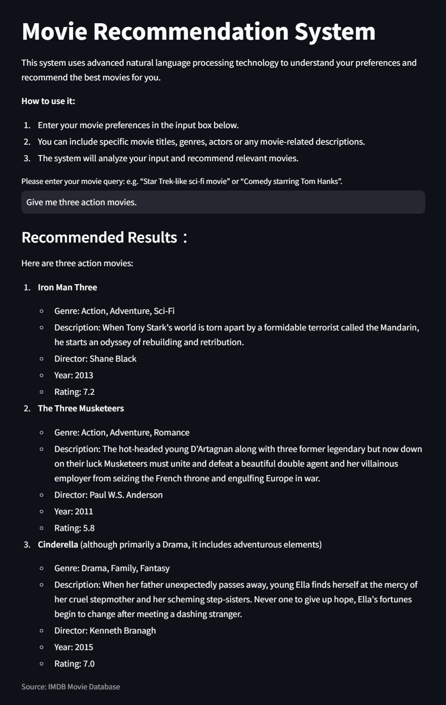

# Movie Assistant

## Project Overview
The Movie Assistant is a system designed to help users find detailed and relevant information about movies by leveraging Retrieval-Augmented Generation (RAG) techniques. 
This project aims to enhance the movie discovery experience by enabling users to ask specific questions and receive accurate, contextually relevant answers based on a comprehensive movie dataset.

## Project Details
- Dataset: [BrendanMartin/IMDB-Movie-Data.csv](https://github.com/LearnDataSci/articles/blob/master/Python%20Pandas%20Tutorial%20A%20Complete%20Introduction%20for%20Beginners/IMDB-Movie-Data.csv)
- LLM: [gpt-4o-mini](https://platform.openai.com/docs/models/gpt-4o-mini)
- Embedding model: [multi-qa-MiniLM-L6-cos-v1](https://huggingface.co/sentence-transformers/multi-qa-MiniLM-L6-cos-v1)
- Database: ElasticSearch

## Prerequisites
- Python 3.12 or higher
- Docker

## Install and Set Up

1. Create a Python Virtual environment and install the required dependencies 
    ```
    pip install -r requirements.txt
    ```

2. Start the Docker containers and launch the application by running ./start.sh.
    ```
    ./start.sh
    ```

3. Open the displayed URL in the browser on the Windows host. (http://localhost:8502)

4. Feel free to ask questions about the movie such as its title, genre, description, director, and actors.

Warning: This project has only been tested on WSL2-Ubuntu. Compatibility with other operating systems is not guaranteed.

## Dataset

Dataset: [BrendanMartin/IMDB-Movie-Data.csv](https://github.com/LearnDataSci/articles/blob/master/Python%20Pandas%20Tutorial%20A%20Complete%20Introduction%20for%20Beginners/IMDB-Movie-Data.csv)

## How to execute it
1. Type something about the movie you're searching for, including the "Title, Genre, Description, Director, or Actors".
2. When there is the fit movie, it can provide some information about "Title, Genre, Description, Director, Actors, Year, Runtime (Minutes), Rating, Votes, Revenue (Millions), Metascore"

## Below is a preview of the application interface:

